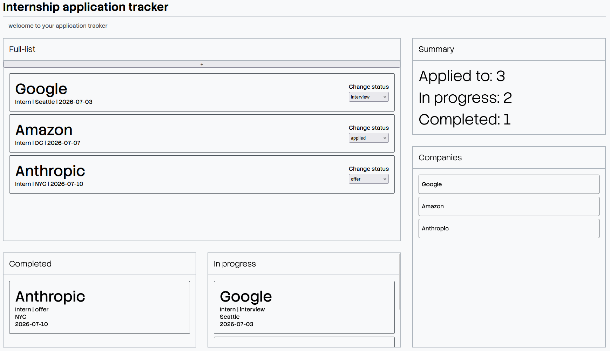

# Internship Application Tracker

A desktop dashboard for tracking internship applications through every stage of the process, from just applying to recieving the offer / rejection

🔗 **Live Demo:** [vclaudio11.github.io/Internship-application-tracker](https://vclaudio11.github.io/Internship-application-tracker)



---

## Built With

- TypeScript
- HTML5
- CSS3 (Grid Layout)
- Vite

---

## Features

- Add applications through an inline form with company, job title, location, deadline, and status
- Five-state status tracking: `to apply` → `applied` → `interview` → `offer` → `rejected`
- Update application status live through drop down panels with live updates
- Full-list panel displaying all applications with live status dropdowns
- In Progress panel filters applications with `to apply`, `applied`, or `interview` status
- Completed panel filters applications with `offer` or `rejected` status
- Summary counters showing total, in-progress, and completed counts
- Unique company list derived from active applications

---

## Getting Started

### Prerequisites
- Node.js v18+
- npm

### Installation

```bash
git clone https://github.com/vclaudio11/internship-tracker.git
cd internship-tracker
npm install
npm run dev
```

Open `localhost:5173` in your browser.

---

## Roadmap

- [ ] Add media queries for different breakpoints
- [ ] Add icons and company logos after adding an application
- [ ] Allow each application to open a new page to store matching CVs or interview materials
- [ ] Restyle and update UI/UX design
- [ ] add local storage for memory storage
 
---

## Author

**Von Gabrielle Claudio** — [@vClaudio11](https://github.com/vclaudio11)